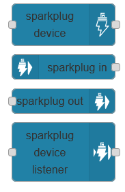
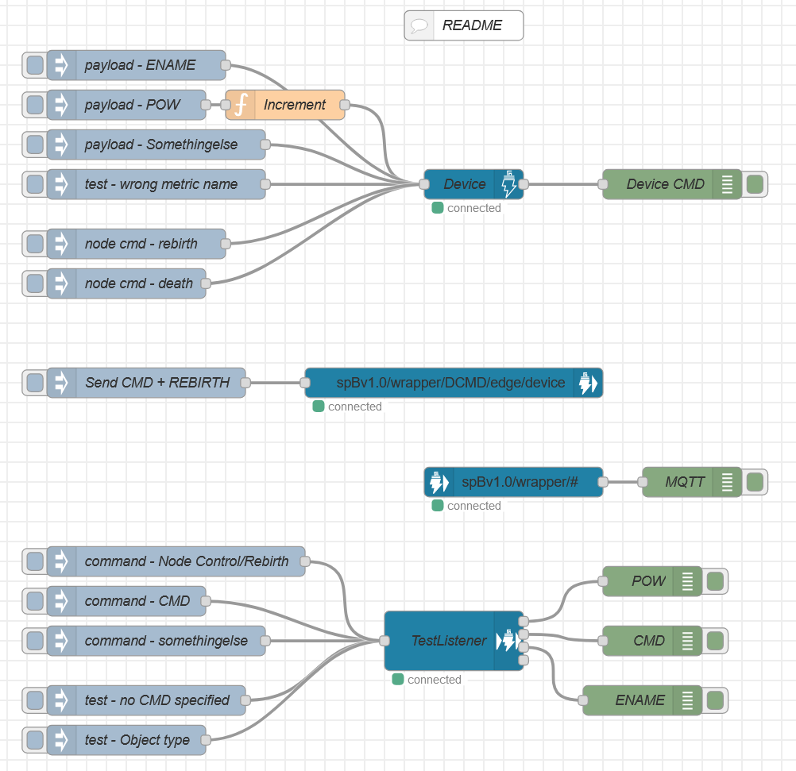

# Node-Red - MQTT Sparkplug Wrapper

Node-Red mqtt-sparkplug-wrapper is a set of Node-Red nodes, that will enable Node-Red to communicate with other client over MQTT using the Sparkplug b (spB) protocol. To know more about the Eclipse Sparkplug B standard visit their website [Eclipse Sparkplug](https://sparkplug.eclipse.org/). 

#### Implemented features

 - **sparkplug device** - Create a sparkplug device edge (EoN) / device (EoND) node.
 - **sparkplug in node** - Attach to a spB topic and parse messages.
 - **sparkplug out node** - Publish a sparkplug message to a specific topic.
 - **sparkplug device listener node** - This node will receive the data from an existing spB node, as well as being able to send commands.
 - Added a **node-red flow to test** all the different node functions (see folder *./examples/*)

#### Pending TODO tasks

  - [ ] Create the node documentation
  - [ ] Create the repository documentation
  - [ ] Node unit testing

# Installation

At the moment you will need to install the module manually, you can install it using a compress file.

# Usage

The easiest way to get started is to start with the example that is provided with the module.

## From Example - Testing Nodes

1. Open the Node-Red Export Dialog
2. Select the Examples Tab
3. Navigate to *node-red-mqtt-sparkplug-wrapper*, and select the *Testing Nodes* Example
4. Deploy changes to Node-Red
5. You can use the different inject nodes to test the different functionalities.

*Requirements:*  You'll need a MQTT broker running on your local computer

## Manual Configuration

1. Drag a **mqtt sparkplug device** to the Node-Red Runtime. 
2. Configure MQTT broker connection for the device
3. Configure the name (this will be the name used in the messages) and the metrics
4. Configure upstream node-red nodes to send metrics data to the **mqtt sparkplug device** 
5. Configure downstream node-red nodes to handle NCMDs (write commands)

**Note** - This node is based on the mqtt-sparkplug-wrapper source code at [GitHub Repository](https://github.com/thomassorensen2650/node-red-contrib-mqtt-sparkplug-wrapper)
